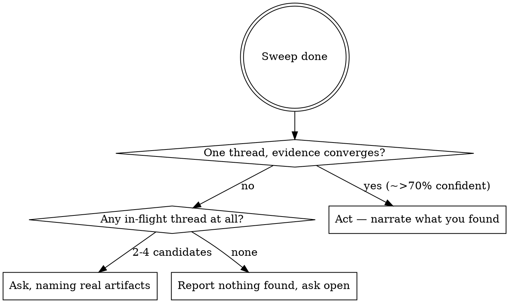

# Orienting

## Overview

When the prompt doesn't tell you what to do, **don't guess and don't ask blindly.** The repo and filesystem almost always hold the answer. Run a complete, ordered sweep, then take one of three outcomes: act, ask a *grounded* question, or report that nothing's in flight.

**Core principle: orient from artifacts, not intuition.** A guess from priors is worse than a 60-second sweep of git, plans, PRs, and session state. Resumed agents that skip this hallucinate work that never happened or latch onto the wrong thread.

## When to Use

- Vague prompt: "continue", "next", "carry on", "what's left", "finish it up", "keep going"
- Resumed after a pause; you don't recognise the topic
- A scheduled / `/loop` / cron wakeup fires with no setup
- You're about to ask "what would you like me to do?" with no specifics
- You feel the urge to pick something plausible-looking and start coding

**Do NOT use when:** the user gave a clear self-contained task (just do it), or you already have active TodoWrite todos (keep executing). The trigger is the *prompt's* clarity, not the repo's state — a repo full of uncommitted work and 40 worktrees does **not** mean orient if the user's ask is unambiguous.

## The Sweep — run in order, don't skip

Baseline testing showed agents each invent their own partial sweep and silently skip sources. Run **all** of these unless you hit a decisive answer early. Batch the independent reads into parallel calls.

1. **Re-read the user's last 1–2 messages literally.** Nouns/verbs you skimmed often disambiguate. "Continue the latency work" isn't vague.
2. **Session state first** — the strongest "what was I *just* doing" signal, and the one most often skipped:
   - `git status` (uncommitted/staged = work in flight), `git stash list`, `git reflog -15`. Don't over-filter — untracked new files are easy to grep away, and they're often the heart of the in-flight work.
   - shell history, any `task_plan.md` / `progress.md` / TODO scratch files, a running dev server
3. **`git log --oneline -15`** + `git log main..HEAD` — the active theme and unmerged commits.
4. **Worktrees & branches:** `git worktree list`, `git branch --sort=-committerdate | head`.
5. **Open + recent PRs:** `gh pr list --state open` and `--state merged --limit 5`. **Don't skip this** — baseline agents routinely forgot it. Run `gh pr checks` on the freshest to surface failing CI.
6. **Planning artifacts — open and READ them, don't just read filenames:**
   - `task_plan.md`, `progress.md`, `findings.md`; `.superpowers/`; `docs/superpowers/plans/*.md`; `docs/research/*.md`; root `TODO.md`/`NOTES.md`
   - If `planning-with-files` is in use, run `planning-with-files:status`.
   - **Read the plan body to find the next unstarted step.** Characterising "themes" from commit/PR *titles* alone is a baseline failure — it misses the actual next action inside a written plan.
7. **Project `CLAUDE.md` / `AGENTS.md`** if not already loaded — often names the live workstreams.

Stop the sweep as soon as the path is unambiguous. This is triage, not exploration.

## The recency trap

The most common baseline error: **"most recently touched worktree/branch = the work."** Directory mtimes get bumped by builds, lint caches, and background agents — recency is a hint, not proof. Before committing to a candidate:

- **Confirm it's coherent in-flight work** — real uncommitted hand-written changes, not just a regenerated artifact (`whats-new.json`, `*.tsbuildinfo`).
- **Check whether it already shipped.** A freshly-dated plan/doc may describe work that's already merged (verify against `git log origin/main` / a closed PR). Re-doing finished work is the failure here.
- **Cross-check against other same-day threads.** If two+ threads were touched today, recency alone can't pick between them — that's an *ask* situation (see below), not a coin-flip.

## After the sweep: three outcomes

**A — Converges on one thread (you're ~>70% confident).** Narrate the evidence ("uncommitted feature + spec dated today in worktree X, no PR yet — finishing it"), then act.

**B — 2–4 plausible candidates.** Use `AskUserQuestion`. **Every option must name a real artifact** — branch, PR number, plan filename — not an abstract category. Offer the recency frontrunner first so the user has a one-word path, but don't pretend it's certain. Asking a sharp question beats a confident wrong guess.

**C — Nothing in flight.** Say so explicitly and ask. Don't fabricate. "Checked git state, plans, and open PRs — no in-flight work I can identify. What should we work on?"

## Pressure makes guessing feel justified — it isn't

Under "we're almost done, finish it tonight," baseline agents felt pulled to grab the freshest thread and start "wrapping it up" to show momentum. The tells: hunting for *something to latch onto* rather than neutrally asking "is there enough signal to act at all?"

**A tired user who can't course-correct makes a wrong guess MORE costly, not less.** Momentum pressure is exactly when picking-something-plausible is most dangerous. The sweep is cheap; finishing the wrong thing overnight is not. Run the sweep, and if it lands in outcome B/C, ask the one cheap question.

## Rationalizations — STOP

| Thought | Reality |
|---|---|
| "Most recent worktree is obviously it" | mtime ≠ intent. Confirm coherent WIP and cross-check same-day threads first. |
| "The titles tell me the theme" | Open the plan. Titles miss the next concrete step. |
| "They're in a hurry, I'll just start the freshest thing" | Pressure makes guessing feel justified. Wrong guess at night is costlier. Ask. |
| "I'll skip PRs / stash / history to be fast" | That's how baseline agents missed the live thread. Run the full sweep. |
| "I'll ask what they want" (before looking) | Sweep first. Then ask a question grounded in artifacts. |
| "This doc is fresh, so it's the task" | It may already be merged. Verify against the commit log. |

## Worked example

This very repo on a bare "continue": main is clean but 18 behind origin; `git status` shows untracked `docs/research/2026-05-22-section-order-baseline.md` and two plan docs. Tempting to start on the section-order doc — but `git log origin/main` shows that work **already shipped** (the doc is residue). The sweep then finds a worktree with uncommitted hand-written module + test + spec dated today and no PR. That convergence (real WIP + today + no PR) → outcome A: finish and ship it. The trap avoided: trusting the freshest *filename* instead of verifying it against the commit log.

## Composition

- No work in flight and the user wants something *new* → `superpowers:brainstorming`.
- A written plan exists and you've found the next step → `superpowers:executing-plans`.
- `planning-with-files` repo → `planning-with-files:status` is a fast subset of step 6.
